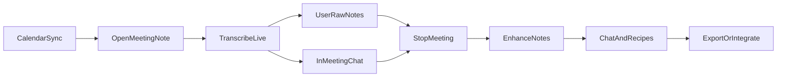
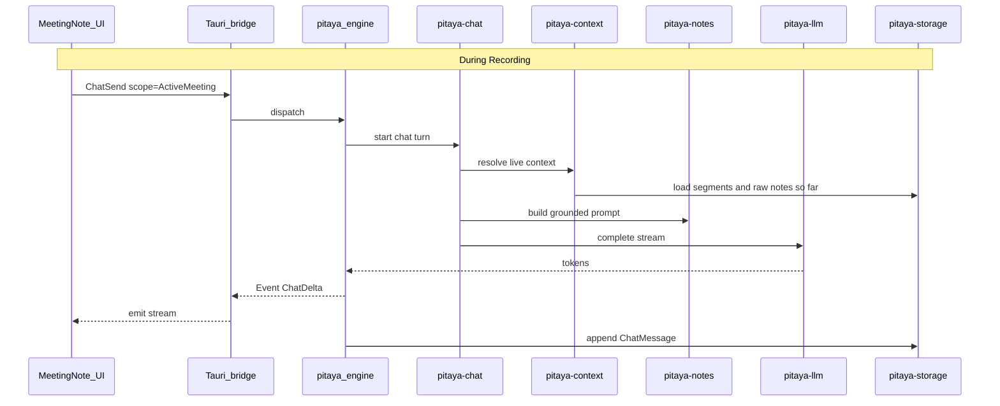
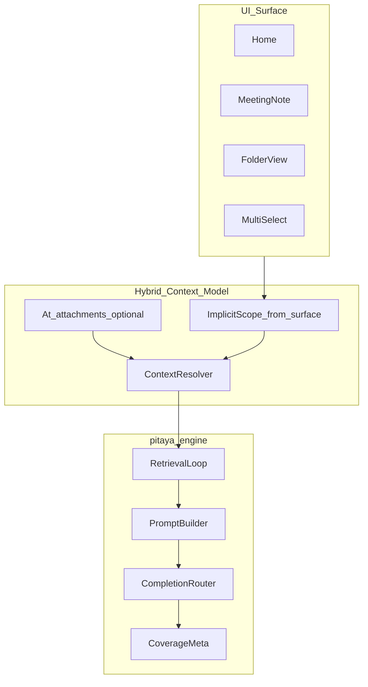
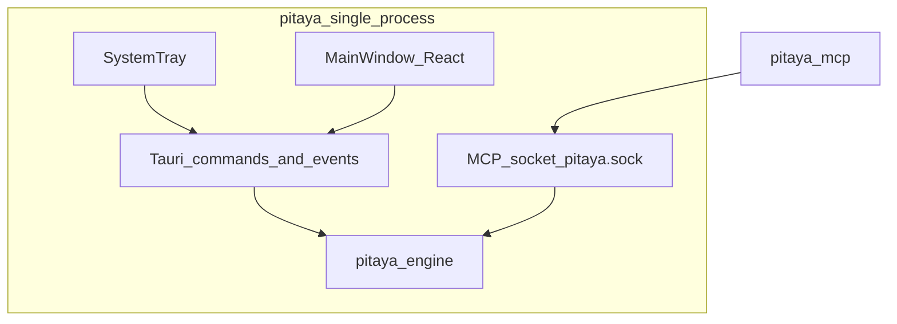
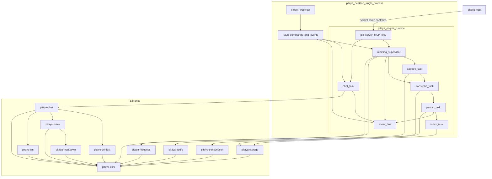
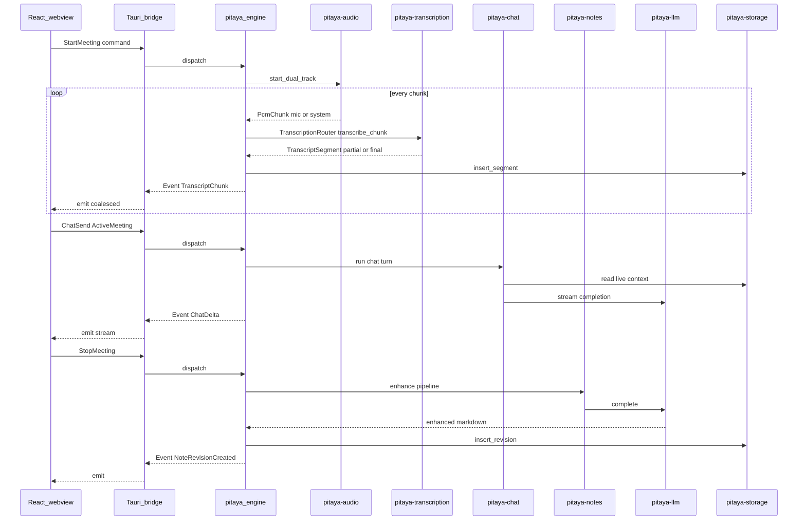
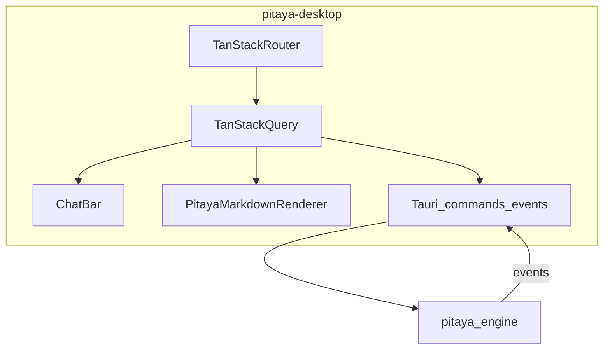
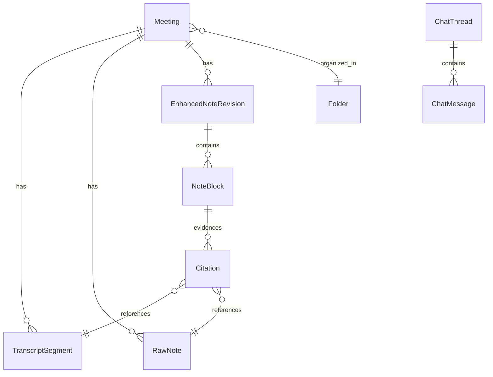
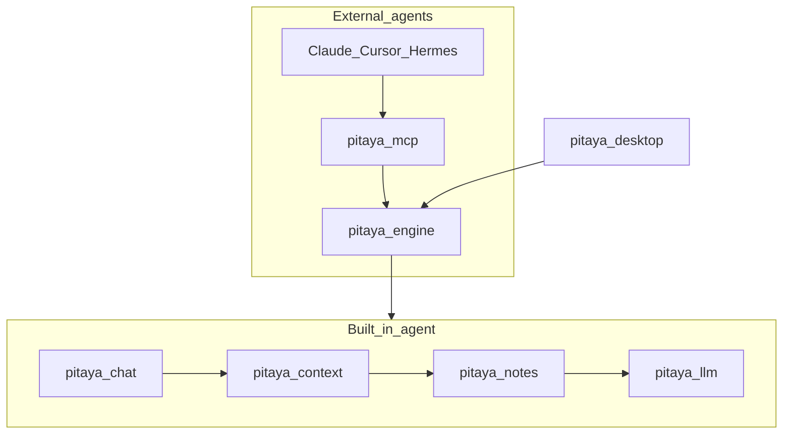
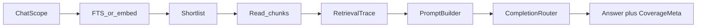

# Pitaya Architecture

| Field | Value |
|-------|-------|
| **Version** | 0.6 |
| **Status** | Normative (pre-implementation) |
| **Roadmap** | [ROADMAP.md](ROADMAP.md) v0.5 — product phasing and MVP scope |
| **UI / Themes** | [DESIGN.md](DESIGN.md) — dark theme tokens; Stitch prompt docs are planned |
| **Last synced with Granola docs** | 2026-05-22 ([docs.granola.ai/llms.txt](https://docs.granola.ai/llms.txt)) |

Pitaya is a Linux-first meeting assistant modeled on [Granola](https://granola.ai)'s documented product behavior: a **Tauri monolith** (`pitaya-desktop`) with an in-process **`pitaya-engine`** (Tokio) and optional **`pitaya-mcp`** for agents. Speech and language models are pluggable through **`pitaya-transcription`** and **`pitaya-llm`** (local-first defaults, optional cloud BYOK)—inspired by [Handy](https://github.com/cjpais/Handy) for on-device speech, without mandating local-only for every user.

**Executive summary:** Granola-class meeting OS on Linux—ambient tray, full meeting loop (including **in-meeting Q&A**), trustworthy agentic chat, secure extension boundaries, and OSS end-to-end. Speed comes from one in-process Tokio runtime, **dual transport** (Tauri commands for UI; Unix socket for MCP), semantic crates, bounded work queues, and adapter routers—not from cutting product value. **Product-first** sections describe user-visible behavior; **implementation** sections describe Rust crates. **Pitaya delta** marks intentional differences from Granola.

### Glossary

| Term | Meaning |
|------|---------|
| **Quick Note** | Ad-hoc meeting note; explicit start of capture |
| **BYOK** | Bring your own API key (cloud ASR/LLM adapters) |
| **Engine** | `pitaya-engine` library — Tokio task graph, FSM, MCP socket; started inside `pitaya-desktop` |
| **Dual transport** | UI uses **Tauri commands + events**; `pitaya-mcp` and other external clients use **Unix socket** (`pitaya.sock`) |
| **Coverage metadata** | Chat UI showing which meetings/notes were consulted (Granola “Coverage Notes” pattern) |
| **Context attachment** | User-pinned `@` reference in chat input (`ContextRef`); narrows or extends implicit scope |
| **Implicit scope** | Default chat context from UI surface (home, meeting, folder, selection)—Granola parity |
| **ChatScope** | Enum describing where chat was opened; drives base context before `@` merge |
| **DTO** | Serializable contract type in `pitaya-core` |
| **prompt_version_id** | Stable id for a prompt registry entry; stored on `ChatMessage` with content hash for replay and snapshot tests |
| **Bundled manifest** | Origin-hash map (`.bundled_manifest`) for shipped recipes/templates under `$XDG_DATA_HOME/pitaya/`; prevents upgrades from overwriting user edits |
| **Iteration budget** | Per-`ChatSend` cap on retrieval passes and LLM completion rounds; overflow sets `CoverageMeta.incomplete` |

---

## 0. Architectural principles

1. **One runtime source of truth:** `pitaya-engine` inside `pitaya-desktop` owns lifecycle, tasks, event fan-out, and the MCP socket; feature semantics live in libraries. UI hot path uses Tauri commands—not the socket.
2. **Crates are boundaries, not folders:** `pitaya-core` is the stable shared contract crate. Domain crates own invariants; infrastructure crates isolate SQLite, PipeWire, model runtimes, HTTP, and Tauri.
3. **Local-first with explicit escape hatches:** offline ASR and Ollama are first-class; cloud ASR/LLM runs only when configured by the user, with visible adapter state and no silent provider switch.
4. **Backpressure over surprise:** every hot path uses bounded queues, coalesced UI events, explicit cancellation, and crash-safe persistence.
5. **Grounded AI over confident AI:** chat, recipes, enhancement, and MCP answers surface coverage, citations, incomplete context, and retrieval traces where useful.
6. **Extensions cross protocol boundaries:** v1 extension surfaces are stable IPC, MCP, recipes, and compiled adapters. Third-party plugins must be process-isolated or protocol-isolated; no Rust `cdylib` plugin ABI in v1.
7. **Control flow in Rust, prompt content versioned:** orchestration, retrieval policy, and iteration budgets live in compiled crates (`pitaya-chat`, `pitaya-context`, `pitaya-engine`); prompt *content* lives in the `pitaya-notes` registry with version ids and snapshot tests—not in YAML agent graphs or runtime interpreters.

---

## 1. Product and Granola parity

### 1.1 North star

| Surface | v1 requirement |
|---------|----------------|
| System tray | Start/stop, status, notifications, open app—works with main window closed |
| Home | Today / upcoming (manual v1), recent notes, search, folders (basic) |
| Meeting note | Raw editor + live transcript (mic + system) + **in-meeting chat** + stop |
| Post-meeting | Enhanced notes + per-bullet citations + template regenerate |
| Intelligence | Scoped chat + recipes; Ollama (local) + BYOK (cloud) |
| Settings | Models, retention, BYOK, MCP path, language/jargon |
| Agents | Local MCP stdio (read-first v1, audited mutators) |
| Trust | User chooses providers; no silent provider switches; cloud only when configured |

### 1.2 Locked pillars

| Pillar | Decision |
|--------|----------|
| Distribution | **Native only** for users (AppImage/deb/Tauri bundle); **no Docker** in quick start |
| Process | **Single `pitaya` app** (Tauri monolith); tray always on when app runs |
| Engine | **`pitaya-engine` library on Tokio**—orchestration, MCP socket, tasks; composes libraries only |
| Semantics | **Domain crates** (`pitaya-meetings`, `pitaya-context`, `pitaya-chat`, `pitaya-notes`) own product rules |
| Speech | **`pitaya-transcription`** — ASR/VAD/model catalog over PCM from `pitaya-audio` |
| LLM | **`pitaya-llm`** — completion adapters and model-class routing |
| ASR default | **Local-first** (Handy-style model catalog); **cloud BYOK** optional |
| Completion default | **Ollama** + **BYOK** via `pitaya-llm` |
| Transcripts | **Granola-like:** persist full segments by default; optional auto-deletion; notes unaffected |
| Cost model | **All core features OSS/free**—no PRO gating |
| Feel | Adaptive warm glass: approachable light default + first-class dark theme—not a dashboard or Meetily clone |

| Principle | Pitaya | Granola (docs) |
|-----------|--------|----------------|
| Platform | Linux-first desktop (macOS later) | macOS, Windows, iOS |
| Account | **No cloud account v1**; manual upcoming | Google/Microsoft SSO + calendar OAuth |
| Meeting bot | None — on-device capture | None |
| Transcription | Local-first + cloud BYOK | Real-time **cloud** ASR; **audio not stored** |
| Notes / chat | Local SQLite + Ollama/BYOK | Cloud notes; bundled vendor LLM |
| MCP | **stdio → `pitaya-mcp` → app socket** (app must be running) | [Streamable HTTP + OAuth](https://docs.granola.ai/help-center/sharing/integrations/mcp.md) |

**vs Meetily:** Same Tauri + Rust monolith shape; Pitaya differentiates on Granola-class chat, `@` context, MCP, and [DESIGN.md](DESIGN.md) taste—not on process layout.

**vs Handy:** Handy is push-to-talk in a Tauri monolith; Pitaya is **meetings** (dual-track, live transcript, notes) at Granola depth—**same monolith process model**, different product scope.

**Pitaya delta:** No Granola cloud account; no remote OAuth MCP; no paid tier for core features; transcript MCP tools not plan-gated.

### 1.3 Explicit non-goals (v1)

- Docker / compose as required install for desktop users
- Python FastAPI, whisper HTTP sidecar, pyannote sidecar
- Mandatory cloud ASR with no local path
- Team workspaces, calendar OAuth, REST API
- WYSIWYG editor (markdown + Pitaya renderer)
- Diarization as ship blocker (mic/system channels first)
- Flatpak-first distribution (sandbox breaks system audio capture)

Granola references: [Granola 101](https://docs.granola.ai/help-center/getting-started/granola-101.md), [Transcription](https://docs.granola.ai/help-center/taking-notes/transcription.md), [Setup](https://docs.granola.ai/help-center/getting-started/setting-up-granola-for-the-first-time.md).

### 1.4 Chat as core pillar

Chat is **co-equal** with capture → transcript → raw notes → enhance—not a post-processing add-on. Granola’s rebuilt agentic chat ([blog](https://www.granola.ai/blog/granola-chat-just-got-smarter)) treats the “Ask anything” bar as the **primary intelligence surface** for catch-up during calls, post-meeting Q&A, cross-meeting retrieval, and recipes.

| Chat surface | Client | Contract path | Phase |
|--------------|--------|---------------|-------|
| Meeting note bar | `pitaya-desktop` | Tauri `ChatSend` + events | P3 shell; P4 intelligence |
| Home / folder chat | `pitaya-desktop` | Same `ChatSend`; scope from surface | P5 |
| Agent queries | `pitaya-mcp` | `query_meetings` → same retrieval as chat | P5 |

**Normative loop:** every chat turn flows **UI (Tauri) / MCP (socket) → engine → `pitaya-chat` → `pitaya-context` resolver → `pitaya-notes` prompt/grounding helpers → `pitaya-llm` → stream + `CoverageMeta` → storage writer**. No provider HTTP in the webview.

**Pitaya delta:** Granola scopes chat **implicitly** from UI location only. Pitaya adds **hybrid context**—implicit scope plus optional Cursor-like `@` attachments (§2.6)—while preserving Granola defaults when attachments are empty.

---

## 2. User journeys and policies

### 2.1 End-to-end meeting loop



1. **Upcoming** — manual list v1; Google/Outlook later.
2. **Open note** — calendar event or Quick Note (explicit).
3. **Transcribe** — dual-track (`mic` + `system`), live partials **persisted to SQLite**.
4. **Raw notes** — markdown during call; timeline-bound.
5. **In-meeting chat** — Q&A over live transcript + raw notes (Granola parity; see §2.5).
6. **Stop** — manual or assistive auto-stop (never silent auto-start).
7. **Enhance** — transcript + raw notes + calendar + profile.
8. **Chat / recipes** — scoped Q&A; home/folder/multi-meeting in P5.
9. **Export** — markdown/HTML; MCP.

### 2.2 Meeting modes and start/stop

| Mode | Start | Stop |
|------|-------|------|
| **Calendar-linked** | Open note; optional auto-start at event time | Manual + calendar end + call-end + inactivity |
| **Quick Note** | User creates note and starts capture | Manual + call-end + inactivity |

Transcription **starts** only on: open note, Quick Note, notification accept, or confirmed call-detection suggestion.

Transcription **stops** on: user Stop, call-end heuristics, **15 minutes** without new audio ([Granola](https://docs.granola.ai/help-center/taking-notes/transcription.md)), or system sleep.

**Back-to-back meetings:** explicit Stop between calls; distinct `meeting_id` per note.

**Pitaya delta:** Linux call-detection (PipeWire + VAD + app hints) is assistive only.

### 2.3 First-run onboarding (v1)

Granola uses SSO, calendar permissions, and a **demo meeting**. Pitaya v1:

| Step | Pitaya |
|------|--------|
| 1 | **Local transcription (recommended)** → download model from catalog, or cloud BYOK |
| 2 | Detect **Ollama** or BYOK or **Skip** |
| 3 | **Guided Quick Note** tour (tray + live bars); optional bundled sample meeting JSON |
| — | No Google/Microsoft SSO in v1 |

Goal: **first meeting without any API key.**

### 2.4 UX surfaces (`pitaya-desktop`)

| Surface | Granola analog | v1 |
|---------|----------------|-----|
| **System tray** | Menu bar | **Yes** — primary ambient control |
| Home | Coming up + notes | Yes |
| Meeting note | Note view | Raw + enhanced + provenance |
| Transcript panel | Waveform icon **left of** chat bar | Virtualized; mic vs system |
| **Chat bar** | “Ask anything” at bottom | **Yes** — including **during** recording |
| Templates / recipes | Yes | Yes |
| Settings | Preferences | Models, retention, BYOK, MCP |
| Floating indicator | Live chip | Post-v1 |

### 2.5 In-meeting chat (v1 — Granola parity)

Granola is **not** summarize-only during calls. The meeting note has a bottom **“Ask anything”** bar; live transcript is toggled via the waveform control **to the left** of the bar ([chat](https://docs.granola.ai/help-center/getting-more-from-your-notes/chatting-with-your-meetings.md), [transcription UX](https://docs.granola.ai/help-center/taking-notes/transcription.md)).

| Behavior | Granola | Pitaya v1 |
|----------|---------|-----------|
| **When** | Before, **during**, and after meeting | `ChatSend` + `ChatScope::ActiveMeeting` while `Recording` or `Paused` |
| **Uses during call** | Catch up; action-item recap; clarify topic | Same |
| **Context** | Scope = where chat is opened; **notes + transcript** | Final + recent partial `TranscriptSegment`s, `RawNote`s, metadata; **no** enhanced note until post-stop |
| **Dictation** | Mic on chat bar = question only, not transcription ([dictation vs transcription](https://docs.granola.ai/help-center/getting-more-from-your-notes/granola-chat-dictation-vs-transcription.md)) | Typed input v1; dictation post-v1 |
| **Rewrite** | “Rewrite” on note sections (desktop) | **Post-stop** v1; during-meeting = Q&A only |
| **Privacy** | Chat private per user if note shared | `ChatThread` local |



**Ship in P4** (with enhance), not Post-P5—users expect catch-up **during** the call.

### 2.6 Hybrid context model (implicit scope + `@` attachments)

Granola sets context by **where chat opens** ([chatting with meetings](https://docs.granola.ai/help-center/getting-more-from-your-notes/chatting-with-your-meetings.md)): home = all notes, meeting view = that meeting, folder = folder contents, checkbox multi-select = selected meetings. Next-gen Granola does not require manual transcript toggles—the surface implies context.

Pitaya preserves that default and adds **optional `@` attachments** (Cursor-inspired) so users can pin or narrow context without leaving the chat bar.



**Base scope** (Granola parity—`ChatScope`):

| Scope | Surface | Default context |
|-------|---------|-----------------|
| `ActiveMeeting` | Recording/paused meeting note | Live `TranscriptSegment`s + `RawNote`s; no enhanced until post-stop |
| `SingleMeeting` | Post-stop meeting note | Full transcript + raw + latest enhanced revision |
| `Folder` | Folder view chat | Meetings in folder; enhanced notes first, transcript on demand |
| `Home` | Home chat | All local meetings (retrieval §7) |
| `Selection` | Multi-select from home/folder | Selected `meeting_id`s only |

**`@` attachments** (`ContextRef`—Pitaya delta):

| Attachment | Effect |
|------------|--------|
| `@meeting:<id>` | Pin one meeting (union if multiple) |
| `@folder:<id>` | Pin folder subset |
| `@note:<meeting_id>` | Raw + enhanced body only; skip transcript unless also `@transcript` |
| `@transcript:<meeting_id>` | Transcript segments for that meeting |
| `@today` / `@recent:{days}` | Time-bounded shorthand (P5) |

**Merge semantics (normative):**

1. **Empty attachments** → implicit scope only (Granola-default UX).
2. **Multiple `@meeting`** → union (explicit multi-meeting within resolver).
3. **Attachment ∩ base scope** when both apply: if `@meeting:X` ∉ folder base scope → **exclude with `ChatContextWarning`**; do not silently widen folder privacy boundaries.
4. **Coverage UI** distinguishes **pinned** (`pinned_attachments`) vs **consulted by agent** (`consulted_meetings`)—see §2.7.

**Phase rollout:** P4 — optional `@note` / `@transcript` on active/single meeting; P5 — full `@` picker + home/folder/selection agentic retrieval.

### 2.7 Chat UX surfaces

| Element | Behavior | Phase |
|---------|----------|-------|
| **Scope label** | Muted text above input: “Active meeting”, “All notes”, folder name | P3 shell |
| **Pinned `@` chips** | Removable row above input; one chip per `ContextRef` | P4 partial; P5 full picker |
| **`@` autocomplete** | Popover: recent meetings, folders, “This meeting’s transcript”; `ListContextCandidates` query | P5 |
| **`/` recipe picker** | Static recipe list; `RunRecipe` | P5 |
| **Thread panel** | Streamed replies; collapsible during typing | P3 layout; P4 streaming |
| **Coverage chips** | Two groups: **Pinned by you** vs **Consulted** (Granola Coverage Notes) | P4 single; P5 multi |
| **Transcript toggle** | Waveform icon **left of** bar; opens drawer—not dictation | P3 |
| **Rewrite** | Highlight section + “rewrite” in chat; post-stop only | P4 |

Stitch prompts: planned under `docs/design/` when the design scaffold exists; [DESIGN.md](DESIGN.md) is the current dark-theme source.

---

## 3. Distribution and install

### 3.1 End-user path

| Audience | Path |
|----------|------|
| End users | Install `pitaya` (AppImage or `.deb`)—**one process**, no separate engine install |
| Power users | Optional `pitaya-mcp` on PATH; connect via Unix socket when app is running |
| CI | `cargo test` / `cargo build` on Linux |
| Future | Optional headless binary extracted from `pitaya-engine` for server/CI—not desktop GUI in Docker |

**First-run:** small installer → Settings → Models download (Handy-style) → tray Quick Note works offline.

**Quit policy (v1):** tray Quit exits app; engine shuts down cooperatively.



Tray handlers are **thin**: engine events → icon, menu, notification; tray commands invoke Tauri → engine. Settings provides **Copy MCP config** for Claude/Cursor (P5).

### 3.2 Paths and layout

| Path | Purpose |
|------|---------|
| `$XDG_DATA_HOME/pitaya/` | SQLite, models cache (`models/`), exports |
| `$XDG_DATA_HOME/pitaya/recipes/` | User recipes; shipped defaults synced from app bundle with `.bundled_manifest` |
| `$XDG_DATA_HOME/pitaya/templates/` | User templates; same origin-hash sync policy as recipes |
| `$XDG_RUNTIME_DIR/pitaya/pitaya.sock` | MCP/external IPC socket (`0600`); UI uses Tauri commands, not this path |
| `$XDG_CONFIG_HOME/pitaya/` | User settings (`settings.toml` with schema version) |

Models: **not** in installer; cache under `PITAYA_DATA_DIR/models/` (Handy-aligned); manual GGML paths supported.

### 3.3 Linux desktop constraints

| Topic | Requirement |
|-------|-------------|
| **Audio** | PipeWire mic + monitor capture; pulse compat where needed |
| **Tray** | StatusNotifier (Wayland) or `libappindicator` (X11) |
| **Secrets** | `libsecret` / Secret Service for BYOK via `keyring` |
| **GPU** | Optional for `gpu-whisper` feature |
| **Permissions** | Mic + monitor capture consent (portal / PipeWire checklist in onboarding) |
| **Anti-patterns** | Flatpak-first; Docker GUI + audio passthrough |

Optional: `pitaya-desktop --check-deps` prints missing system libraries (appendix).

**Do not:** require Docker for desktop; multi-container compose as primary path.

---

## 4. Runtime architecture

**Locked:** `pitaya-engine` inside `pitaya-desktop` is the runtime source of truth. The webview is a thin shell (**Tauri commands + events**). `pitaya-mcp` is an external client over the MCP socket. **No inference in the webview.**

### 4.1 Component diagram



### 4.2 Meeting capture and enhance flow



### 4.3 Engine FSM and tasks

**States:** `Idle` → `ArmingCapture` → `Recording` ↔ `Paused` → `Stopping` → `PostProcessing` → `Idle`; `ErrorRecoverable` / `ErrorFatal`.

| Task | Calls into | Owns | Emits |
|------|------------|------|-------|
| `ipc_server` | `pitaya-core` codecs; engine routers | MCP/external socket lifecycle | request replies |
| `meeting_supervisor` | `pitaya-meetings`, storage repos | meeting FSM runtime state | lifecycle events |
| `capture_task` | `pitaya-audio` | PipeWire session bridge | PCM → bounded channel |
| `transcribe_task` | `pitaya-transcription` | ASR worker budget | transcript segments |
| `persist_task` | `pitaya-storage` | writer actor queue; WAL batching | persistence acks |
| `chat_task` | `pitaya-chat` | chat turn cancellation and stream fan-out | `ChatDelta`, `ChatDone`, warnings |
| `index_task` | `pitaya-storage` | async FTS/vector maintenance | index health events |
| `event_bus` | — | broadcast subscriptions | events to Tauri bridge and MCP subscribers |
| `tauri_bridge` | `EngineHandle`; `AppHandle` emit | UI command dispatch; coalesced transcript events | Tauri events to webview |

Per-meeting `CancellationToken`; `tokio::select!` for shutdown; bounded channels. Shutdown is cooperative: cancel intake, close senders, drain `persist_task`, flush indexes, close `TaskTracker`, wait, then force-timeout only after safe persistence boundaries.

### 4.4 Layer rules

| Layer | Crate | Owns | Must never |
|-------|-------|------|------------|
| **Contracts** | `pitaya-core` | DTOs, IDs, enums, schema export, error envelopes | async runtime, HTTP, SQLite, PipeWire, models, workflows |
| **Meeting domain** | `pitaya-meetings` | FSM transitions, start/stop/pause policy, transcript assembly invariants | PipeWire, SQLite, LLM, IPC, UI |
| **Capture** | `pitaya-audio` | dual-track `PcmChunk`; Linux `backend/pipewire.rs`; mock backend | transcribe, LLM, DB, IPC, meeting policy |
| **Speech** | `pitaya-transcription` | VAD, ASR routers, model catalog, ASR fallback | FSM, IPC, UI, notes, chat |
| **Completion** | `pitaya-llm` | completion routers, model classes, key lookup, streaming adapter contracts | prompts, retrieval, UI, storage writes |
| **Context** | `pitaya-context` | implicit scope + `@` merge, context budgets, retrieval planning, `RetrievalTrace`, `CoverageMeta` construction | provider calls, direct DB coupling, UI |
| **Chat** | `pitaya-chat` | chat turn state, recipe execution, rewrite-mode policy, grounded-answer contract | provider adapters, direct SQLite, UI |
| **Notes** | `pitaya-notes` | enhancement prompts, templates, citation synthesis, note revisions | vendor HTTP; direct DB; socket IPC |
| **Markdown** | `pitaya-markdown` | canonical markdown subset, citation AST, export-safe rendering primitives | React-only semantics, storage, inference |
| **Persistence** | `pitaya-storage` | SQLite, migrations, writer actor, repositories, FTS/vector indexes, audit/retention jobs | inference, audio capture, prompt policy |
| **Orchestration** | `pitaya-engine` | Tokio task graph, MCP socket, dependency wiring, event fan-out, shutdown | feature semantics, inline whisper/SDK, React, Tauri |
| **Shell** | `pitaya-desktop` | tray, React, Tauri command bridge, engine startup | business rules, ASR, DB, MCP socket policy |
| **Agents** | `pitaya-mcp` | stdio MCP → IPC | storage/ASR internals |

**Dependency direction:** binaries depend inward on libraries; libraries never depend on binaries. Consumer crates define small traits for collaborators where it prevents concrete coupling; `pitaya-engine` wires implementations; `pitaya-desktop` starts the engine and exposes thin Tauri commands. Native/system dependencies stay at the edge (`pitaya-audio`, `pitaya-transcription`, `pitaya-storage`, `pitaya-desktop`). `pitaya-core` is the only crate clients and MCP must share directly.

**Avoid:** `pitaya-asr-local`, `pitaya-asr-cloud`, `pitaya-provider-byok`, `pitaya-tray` crates; business logic in React; Rust dynamic plugin crates in v1.

| Crate | Ships as |
|-------|----------|
| `pitaya-core` | library |
| `pitaya-meetings` | library |
| `pitaya-audio` | library |
| `pitaya-transcription` | library |
| `pitaya-llm` | library |
| `pitaya-context` | library |
| `pitaya-chat` | library |
| `pitaya-notes` | library |
| `pitaya-markdown` | library |
| `pitaya-storage` | library |
| `pitaya-engine` | library |
| `pitaya-desktop` | binary `pitaya` |
| `pitaya-mcp` | binary |
| `pitaya-diarization` | library (optional post-v1) |

---

## 5. Contracts and workspace (Rust)

### 5.1 Workspace conventions

| Practice | Normative choice |
|----------|------------------|
| Layout | Root `Cargo.toml` workspace; `resolver = "2"`; MSRV **1.78+** (team may bump) |
| `pitaya-core` | `serde` DTOs, IDs, value objects, `#[non_exhaustive]` enums, **`schemars` or `typeshare`** → TypeScript; **no `async`**, no side effects |
| Errors | `thiserror` in libs; `anyhow` only in binary `main` |
| Async | Per-meeting `CancellationToken`; backpressure: **coalesce** partial `TranscriptChunk` to UI (4–10 Hz) |
| Features | Default = local only; `cloud-asr`, `cloud-llm`, `gpu-whisper`, `vector-search` optional |
| HTTP | `reqwest` + `rustls` in `pitaya-transcription` / `pitaya-llm` only |
| Secrets | `keyring` + Secret Service (Linux), accessed through engine-wired provider traits |
| SQLite | `rusqlite`, WAL, **FTS5** for transcripts/meetings; optional sqlite-vec; batched inserts in `persist_task` |
| Testing | `cargo nextest`; FSM tests; context resolver fixtures; `insta` prompt snapshots; `pitaya-audio` mock backend |
| Unsafe | Only in `pitaya-audio` / `pitaya-transcription`; document invariants |

### 5.2 Dual transport v1 (locked)

**Dual transport (ADR-010):** the webview never uses the socket. External clients never use Tauri.

| Client | Transport | Use |
|--------|-----------|-----|
| **React UI** | **Tauri commands + events** | Hot path: meeting control, transcript coalescing, chat streams |
| **`pitaya-mcp` / tests** | **Unix domain socket** | `$XDG_RUNTIME_DIR/pitaya/pitaya.sock`, mode `0600` |
| **Framing (socket only)** | Length-prefixed JSON (v1); MessagePack optional later |
| **Socket commands / queries** | Request/response over socket |
| **Socket events** | Server-initiated stream on same connection (SSE-style framing) or dedicated subscribe message |

**Not v1:** webview → socket IPC; remote HTTP IPC; ambiguous dual paths for the same UI action.

**Contract freeze gate:** before P3 desktop, `pitaya-core` commands/queries/events versioned, mirrored to TypeScript, and mapped to Tauri commands.

### 5.3 Contract surfaces (`pitaya-core`)

**Meeting lifecycle**

- **Commands:** `StartMeeting`, `StopMeeting`, `PauseMeeting`, `AppendRawNote`, `EnhanceNotes`, …
- **Queries:** `GetStatus`, `GetMeeting`, `ListMeetings`, `SearchTranscripts`, …
- **Events:** `MeetingStarted`, `TranscriptChunk`, `NoteRevisionCreated`, `MeetingEnded`, `ErrorRaised`, …

**Chat (core pillar—§1.4)**

- **Commands:** `ChatSend`, `RunRecipe`
- **Queries:** `GetChatThread`, `ListContextCandidates`
- **Events:** `ChatDelta`, `ChatDone`, `ChatContextWarning`

Chat DTO sketch (freeze at IPC gate before P3 desktop):

```rust
// pitaya-core — chat context (illustrative; names stable at freeze)
enum ChatScope {
  ActiveMeeting,
  SingleMeeting,
  Folder,
  Home,
  Selection,
}

enum ContextRef {
  Meeting(MeetingId),
  Folder(FolderId),
  Note(MeetingId),       // raw + enhanced
  Transcript(MeetingId),
  Today,
  Recent { days: u32 },
}

struct ChatSend {
  thread_id: Option<ChatThreadId>,
  scope: ChatScope,
  scope_ids: Vec<Uuid>,           // folder_id or meeting_ids for Selection
  attachments: Vec<ContextRef>,   // @ pins; empty = implicit scope only
  message: String,
  model_class: Option<ModelClass>,
}

struct CoverageMeta {
  consulted_meetings: Vec<MeetingSummary>,
  consulted_segments: u32,
  pinned_attachments: Vec<ContextRef>,
  retrieval_passes: u32,
  incomplete: bool,
}

struct ListContextCandidates {
  query: String,
  kinds: Vec<ContextRefKind>,     // meeting, folder, note, transcript
  limit: u32,
}
```

- `ChatDone` carries `coverage: CoverageMeta` after stream completes.
- `ChatContextWarning` emitted when an attachment falls outside base scope (§2.6).
- `ListContextCandidates` powers `@` autocomplete (FTS on titles, folder names).

The webview uses **Tauri commands + events** with `pitaya-core` DTOs. `pitaya-mcp` uses **only** `pitaya-core` + socket IPC when the app is running.

---

## 6. Subsystems

### 6.1 Speech and language adapters

Speech and language use separate crates because they have different native dependencies, latency envelopes, failure modes, and privacy risks. The engine sees two capability families: `TranscriptionRouter` from `pitaya-transcription` and `CompletionRouter` from `pitaya-llm`.

```
pitaya-transcription/
  catalog.rs              # ASR catalog, download metadata, cache ids
  vad.rs                  # Silero or equivalent VAD
  router.rs               # ASR adapter selection and segment-boundary fallback
  local_whisper.rs
  local_parakeet.rs
  cloud_deepgram.rs
  cloud_openai_compat.rs

pitaya-llm/
  model_class.rs          # standard / long_context / reasoning
  router.rs               # completion adapter selection and streaming
  ollama.rs
  openai_compat.rs
  anthropic.rs
  openrouter.rs
  keyring.rs              # Secret Service integration behind traits
```

| API | Signature | Owned by |
|-----|-----------|----------|
| Transcription | `TranscriptionRouter::transcribe_chunk(chunk) -> Vec<TranscriptSegment>` | `pitaya-transcription` |
| Completion | `CompletionRouter::complete(request) -> CompletionResponse` (streaming) | `pitaya-llm` |

| Concern | Default | Fallback |
|---------|---------|----------|
| Transcription | `whisper-small-q5` or `parakeet-v3-int8` | Cloud BYOK if configured |
| Completion | Ollama if healthy | BYOK from settings |
| Switch timing | Segment boundary (ASR); request boundary (LLM) | Never mid-utterance |

**Forbidden:** Python sidecar; mandatory `whisper-server` **process**; Docker for desktop; provider HTTP in webview; note/chat prompts inside adapter crates.

| Adapter id | Kind | Crate |
|------------|------|-------|
| `local.whisper_small` | Transcription | `pitaya-transcription` |
| `local.parakeet_v3` | Transcription | `pitaya-transcription` |
| `cloud.deepgram` | Transcription | `pitaya-transcription` |
| `cloud.openai_whisper` | Transcription | `pitaya-transcription` |
| `completion.ollama` | Completion | `pitaya-llm` |
| `completion.openai_compat` | Completion | `pitaya-llm` |
| `completion.anthropic` | Completion | `pitaya-llm` |
| `completion.openrouter` | Completion | `pitaya-llm` |

### 6.2 `pitaya-audio`

```
pitaya-audio/
  capture.rs          # DualTrackCapture, PcmChunk
  backend/
    pipewire.rs       # Linux v1
    mock.rs           # tests / CI
```

PipeWire runs on a dedicated loop thread. Real-time callbacks do minimal work: dequeue/copy PCM, tag `source_track`, send to a bounded channel, and return. VAD and ASR live in `pitaya-transcription`; meeting policy lives in `pitaya-meetings`.

| Catalog id | Engine | Role |
|------------|--------|------|
| `whisper-small-q5` | whisper-rs / GGML | Balanced default |
| `parakeet-v3-int8` | transcribe-rs | CPU-friendly default on weak GPUs |
| `whisper-medium-q4` | whisper-rs | Quality tier |
| `cloud.*` | in-process HTTP via `pitaya-transcription` | BYOK live UX |

### 6.3 Transcription (product)

Aligned with [Granola transcription](https://docs.granola.ai/help-center/taking-notes/transcription.md).

| Channel | Granola UI | Pitaya `source_track` |
|---------|------------|----------------------|
| Microphone | Green / right | `mic` |
| System audio | Grey / left | `system` |

- Partial/final segments → UI **and** SQLite (append-only).
- Stop/Resume without ending session.
- Per-chunk copy, delete, search.

| Topic | Granola | Pitaya |
|-------|---------|--------|
| ASR | Cloud bundled | Local-first; BYOK optional |
| Audio files | Not stored (streamed to ASR) | Optional local chunks (off default) |
| **Transcript text** | **Stored in cloud** | **Stored locally** (see §6.9) |

### 6.4 Note generation

[AI-enhanced notes](https://docs.granola.ai/help-center/taking-notes/ai-enhanced-notes.md).

**Inputs (order matters for prompts):** raw notes (priority for user intent) → capped transcript excerpts → calendar → profile/jargon.

**Outputs:** enhanced revision, citation graph, immutable history.

`pitaya-notes` owns enhancement prompts, template application, citation synthesis, and revision semantics. It receives transcript/raw-note context through traits and calls `pitaya-llm` through a completion trait; it never performs provider HTTP directly and never opens SQLite connections.

### 6.5 Chat and recipes

[Chat](https://docs.granola.ai/help-center/getting-more-from-your-notes/chatting-with-your-meetings.md), [Recipes](https://docs.granola.ai/help-center/getting-more-from-your-notes/recipes.md), [Granola agent design](https://www.granola.ai/blog/how-granola-thinks-about-designing-agents).

Chat is a **core subsystem** (§1.4). `pitaya-chat` owns chat turn orchestration, recipes, rewrite-mode policy, model-class selection, stream state, and grounded-answer behavior. `pitaya-context` resolves scope and retrieval plans. `pitaya-notes` supplies prompt/citation helpers. `pitaya-llm` streams tokens. `pitaya-storage` persists threads through engine-wired repositories.

#### Context resolution

| Scope | Primary index | Deep read |
|-------|---------------|-----------|
| Active meeting | In-memory + SQLite segments | Live transcript + raw notes |
| Single meeting (post) | Segments + enhanced blocks | Transcript excerpts + citations |
| Home / folder / selection | FTS5 (+ optional fastembed) | Enhanced first; transcript on demand |

Flow: `ChatSend` → `pitaya-chat` → **`pitaya-context::ContextResolver`** (implicit scope + `@` attachments, §2.6) → retrieval loop (§7) → `PromptBuilder` → `pitaya-llm` stream → `CoverageMeta`.

`pitaya-context` owns:

- scope merge semantics and `ChatContextWarning` generation;
- context budgets per scope/model class;
- search/shortlist/read planning;
- internal `RetrievalTrace` records for evaluation and debugging;
- user-facing `CoverageMeta` construction.

`pitaya-context` depends on reader traits (`MeetingReader`, `TranscriptReader`, `SearchIndex`) rather than concrete SQLite handles. `pitaya-storage` owns the concrete FTS/vector implementations.

#### `@` picker

- UI sends `attachments: Vec<ContextRef>` on `ChatSend`; empty = Granola implicit scope.
- Autocomplete via `ListContextCandidates` (P5 full; P4 limited to active meeting note/transcript).
- Conflicts → `ChatContextWarning`; excluded pins shown struck-through in UI.

#### Q&A vs rewrite vs recipes

| Mode | When | Allowed |
|------|------|---------|
| **Q&A** | Before, during, after meeting | All scopes |
| **Rewrite** | Post-stop only | Single meeting; highlight-then-chat |
| **Recipes** | Post-enhance preferred | `/` in bar → `RunRecipe`; folder/home in P5 |

During recording: **Q&A only**—no rewrite, no cross-meeting retrieval.

#### Scoped chat matrix

| Scope | Context |
|-------|---------|
| Active meeting | Live transcript + raw notes (§2.5) |
| Single meeting (post) | Full transcript + notes + enhanced |
| Home / folder / multi-select | P5; retrieval §7 |
| Global | All meetings via `Home` scope |

#### Model class routing

Capability classes, not vendor marketing names:

| Class | Use |
|-------|-----|
| `standard` | Fast Q&A, in-meeting catch-up |
| `long_context` | Multi-meeting retrieval |
| `reasoning` | Complex recipes, deep analysis |

User picks Ollama/BYOK model per class in settings. Tray/settings show **active adapter**; no silent switches. Granola auto-selects by scope ([model selection docs](https://docs.granola.ai/help-center/getting-more-from-your-notes/understanding-model-selection-in-granola-chat)); Pitaya exposes class + adapter explicitly.

Chat history **private** per user. File upload: post-MVP.

Recipes: static prompts v1; `/` in chat bar; `RunRecipe` → engine → `pitaya-chat` → `pitaya-context` → `pitaya-notes` prompt helpers → `pitaya-llm`.

#### Prompt assembly and iteration budget (§6.13)

Per `ChatSend`, `pitaya-chat` assembles a **frozen system block once** at turn start: system policy (Rust), scope + attachments, optional recipe body (full text only for `RunRecipe`), and resolved `prompt_version_id` + content hash. **Do not mutate** that system block mid-stream. Retrieved chunks are appended per retrieval pass; live transcript segments for `ChatScope::ActiveMeeting` are read fresh from storage each pass—the frozen part is *prompt policy*, not meeting data.

**Progressive disclosure:** the `/` recipe picker and settings list expose name + description only; full recipe prompt loads at `RunRecipe` execution.

**Iteration budget:** `pitaya-chat` caps retrieval passes and LLM completion rounds per turn (configurable by `ChatScope` / model class). When the budget is exhausted before the answer is complete, set `CoverageMeta.incomplete = true` and disclose what was not reviewed—never emit a confident unsupported answer (§7.1).

#### Granola parity reference

| Granola capability | Pitaya |
|--------------------|--------|
| Implicit scope from surface | Yes (base scope) |
| In-meeting Q&A | Yes (P4) |
| Agentic retrieval + Coverage Notes | Yes (P4 single; P5 multi) |
| Inline citations in answers | Yes (P4) |
| Recipes | Yes (P5) |
| Rewrite sections | Post-stop (P4) |
| Dictation on chat bar | Post-MVP |
| `@` context attachments | **Yes—hybrid delta** (§2.6) |
| 30-day / PRO history cap | **No—local retention, no gate** |

### 6.6 Templates

[Customize notes with templates](https://docs.granola.ai/help-center/taking-notes/customise-notes-with-templates.md). Shape enhanced structure only. `Template` in SQLite.

### 6.7 Frontend (`pitaya-desktop`)

- **Tauri 2** + **React**; TanStack Router, Query, Form, Table, Virtual.
- Design system at P3 start: adaptive warm glass, light theme default, first-class dark theme using [DESIGN.md](DESIGN.md) tokens, 8px grid, calm home (no charts). Stitch prompt docs are planned when the design folder exists.
- Types from `pitaya-core` / schemars; **no business rules in React**.
- TanStack Query wraps **Tauri commands**; live data via **Tauri events** (not socket).
- Provider HTTP **never** in webview.

**Chat bar component** (core UI—§1.4, §2.7):

| Responsibility | Implementation note |
|----------------|---------------------|
| Scope label | Derived from route + FSM state |
| `@` autocomplete popover | `ListContextCandidates`; virtualized list (P5) |
| Pinned `@` chips | Local state + `ChatSend.attachments` |
| `/` recipe picker | P5; invokes `RunRecipe` |
| Thread panel | Subscribes to `ChatDelta` / `ChatDone`; renders coverage chip groups |
| Transcript toggle | Left of bar; drawer only—not dictation |

P3 ships chat **chrome** (layout, scope label, disabled send or setup gate); P4 wires streaming; P5 full `@` picker and home/folder chat.



### 6.8 Markdown renderer

`pitaya-markdown` defines the canonical CommonMark subset, citation AST, validation rules, and export-safe rendering primitives for `[[citation:uuid]]`. Canonical blocks live in storage; React renders typed markdown output but does not define the syntax contract. Exporters use the same crate so UI, HTML, Markdown, and MCP quote paths agree on citation behavior.

### 6.9 Data model and transcript retention



**Transcripts are not ephemeral summaries.** Granola persists full transcript text in the cloud (audio discarded). Pitaya **defaults to Granola-like local persistence:**

| Policy | Behavior |
|--------|----------|
| Default | Append-only `TranscriptSegment` rows for life of meeting and after |
| Auto-deletion | User setting: 1d–1y or **off** ([Granola policy](https://docs.granola.ai/help-center/consent-security-privacy/transcript-auto-deletion.md)); **notes and enhanced revisions kept** |
| After deletion | No regenerate-from-transcript; chat/MCP quote tools fall back to notes-only |
| Audio | Optional debug chunks; **off** by default |

| Retention model | In-meeting chat | Citations | MCP `get_meeting_transcript` |
|-----------------|-----------------|-----------|------------------------------|
| **Granola-like (chosen)** | Strong | Strong | Strong (OSS, no paywall) |
| Hybrid purge post-enhance | Weak later | Degraded | Quotes lost |
| Notes-only | Weak | Note spans only | Summaries only |

**MCP:** `get_meeting_transcript` is high-value because segments live locally (Granola gates by paid plan; Pitaya does not).

### 6.10 Call detection (Linux assist)

PipeWire `application.name`, VAD, known meeting apps → `Idle | Possible | Active | Ending`. Never auto-start without user intent.

### 6.11 Integrations — MCP (v1)

| Granola | Pitaya |
|---------|--------|
| `https://mcp.granola.ai/mcp` + OAuth | **stdio** → `pitaya-mcp` → app socket |
| Paid `get_meeting_transcript` | **Included** (subject to retention) |
| Team folders excluded from MCP | N/A v1 (local single user) |

| Tool | Purpose |
|------|---------|
| `query_meetings` | NL retrieval over local index |
| `list_meetings`, `get_meeting`, `get_meeting_transcript` | Read |
| `list_meeting_folders`, `get_local_profile` | Read |
| `meeting_start`, `meeting_stop`, `note_append`, … | Mutating + **audit** |

**Audit:** `mcp_audit` (tool, meeting_id, timestamp, outcome). Rate limits per tool. Mutations require host confirmation policy.

**Threat model (short):** MCP socket `0600`; app must be running; Settings provides copy-paste MCP config; secrets only through engine-wired keyring traits; webview has no secrets. Full matrix in §9.1.

REST API, Slack/Notion: post-MVP (Granola API shape as reference).

### 6.12 Workspaces (v1 local)

Single-user local workspace; private notes; folders. Team sharing phase 2+. Chat stays author-private when sharing exists.

### 6.13 Agent harness and prompt layers (Hermes-informed)

Informed by [Hermes Agent](https://hermes-agent.nousresearch.com/docs/developer-guide/architecture) (Nous Research): a **custom harness**, not LangGraph/CrewAI—single orchestration loop, layered prompts, local update hygiene. Pitaya applies the **ops patterns**, not Hermes’s general-purpose self-improving skill loop.

#### Agent taxonomy

| Agent | Role | Transport |
|-------|------|-----------|
| **Built-in retrieval agent** | Scoped chat, enhance, recipes—`pitaya-chat` + `pitaya-context` + `pitaya-notes` | Tauri commands + events |
| **External agents** | Claude, Cursor, Hermes, etc.—bring their own loop | `pitaya-mcp` stdio → Unix socket |

External agents consume Pitaya as a **grounded data plane** (meetings, transcripts, folders); Pitaya does not interpret third-party YAML agent graphs in-process.



#### Harness model

- **Owner:** `chat_task` in `pitaya-engine`—cancellation, streaming, persistence fan-out.
- **Loop:** `ChatSend` → scope resolve → retrieval loop (§7) → prompt build → `pitaya-llm` stream → `CoverageMeta` + optional `RetrievalTrace`.
- **No agent framework dependency:** control flow and invariants stay in Rust; MCP is the framework-agnostic extension boundary (ADR-004, ADR-009).
- **Auxiliary model use:** prefer `standard` model class for retrieval summaries and shortlist compression; reserve `long_context` / `reasoning` for multi-meeting chat and complex recipes (§6.5).

#### Prompt layers

| Layer | Source | Frozen per turn? |
|-------|--------|------------------|
| System policy | Rust (`pitaya-chat`, `pitaya-notes` registry) | Yes |
| Scope + `@` attachments | `ChatSend` + resolver | Yes at turn start |
| Recipe / template body | Registry; full body at `RunRecipe` only | Yes when selected |
| Retrieved chunks | `pitaya-context` per pass | Appended each pass |
| Live transcript (in-meeting) | SQLite + in-memory segments | **Fresh read** each pass; not frozen |

Store `prompt_version_id` and **content hash** on each persisted `ChatMessage` for replay, regression, and optional dev export.

#### Bundled recipes and templates

Shipped defaults live in the app bundle; on install and upgrade, sync into `$XDG_DATA_HOME/pitaya/recipes/` and `templates/` with **`.bundled_manifest`** (name → origin content hash):

| Local hash vs manifest | Action |
|------------------------|--------|
| Matches origin | Safe to overwrite with new shipped version |
| Differs | Treat as **user-modified**; skip overwrite on upgrade |
| User wants upstream copy | Settings **Reset to bundled** (clears manifest entry, optional restore) |

Same discipline as Hermes bundled skills; no autonomous agent rewrite of shipped catalog in v1.

#### Local update hygiene

Three storage classes on upgrade:

| Class | Location | On binary update |
|-------|----------|------------------|
| **Code** | AppImage/deb/Tauri bundle | Replaced |
| **Config** | `$XDG_CONFIG_HOME/pitaya/settings.toml` | Forward-migrated via schema version on startup |
| **User data** | SQLite, recipes, templates, models cache | Preserved; SQLite via `pitaya-storage` migrations |

After settings or adapter changes: **cooperative engine restart** inside the running app (drain `persist_task`, flush indexes). Full process restart only when the binary changes. Extend `pitaya-desktop --check-deps` as a **doctor** analogue: deps, config schema, DB migration version, engine health.

#### Dev observability

- **User-facing:** `CoverageMeta`, citations, incomplete-answer disclosure (Granola Coverage Notes).
- **Engineering:** typed `RetrievalTrace`; `tracing` fields include `prompt_version_id`, `retrieval_pass` (§8.3); golden fixtures and `insta` prompt snapshots (§7.3).
- **Optional export (opt-in, default off):** JSONL of `(ChatSend, RetrievalTrace, CoverageMeta, prompt_version_id)` for offline replay—privacy-sensitive; not a product feature in v1.

#### Explicit non-goals (v1)

- YAML/JSON **agent builder platform** or in-process agent graph interpreter
- Hermes-style **self-improving skill loop** or Curator lifecycle for autonomous procedure authoring
- Bounded `MEMORY.md` / `USER.md` scratchpads—domain state lives in SQLite, not a 2k-char markdown file
- LangGraph, CrewAI, or other orchestration frameworks as runtime dependencies

---

## 7. Agentic intelligence and retrieval

From [How Granola thinks about designing agents](https://www.granola.ai/blog/how-granola-thinks-about-designing-agents):

### 7.1 Principles

1. **Breadth over fidelity (cross-meeting):** Prefer enhanced-note summaries across many meetings over full transcripts (~10× tokens).
2. **Fidelity where it matters (single meeting / quotes):** Retained `TranscriptSegment`s for in-meeting chat, citations, `get_meeting_transcript`.
3. **Retrieval loop:** `Search → shortlist → read → repeat` — not read-everything.
4. **Failure taxonomy:** (a) useful + comprehensive, (b) useful + incomplete, (c) incomplete but clear, (d) wrong but confident — **avoid (d)**.
5. **Coverage metadata:** UI shows meetings/notes consulted (Granola Coverage Notes pattern).

### 7.2 Pitaya retrieval (local)

| Scope | Primary index | Deep read |
|-------|---------------|-----------|
| Active meeting | In-memory + SQLite segments | Live transcript + raw notes |
| Single meeting (post) | Segments + enhanced blocks | Transcript excerpts + citations |
| Multi-meeting / home | FTS5 on notes + segments; optional vector index | Enhanced notes first; transcript excerpts on demand |

`pitaya-context` owns the retrieval plan. `pitaya-storage` owns the concrete indexes. P5 starts with SQLite FTS5/BM25 and only enables vectors (`fastembed` or sqlite-vec) after an explicit quality/performance gate. Hybrid retrieval uses Reciprocal Rank Fusion so exact names/terms and semantic paraphrases can both win.

`pitaya-notes`: prompt registry with version ids; citations post-hoc with span IDs. `pitaya-chat`: streaming turn state, recipe execution, incomplete-context disclosure.

**Retrieval iteration budget:** cap `Search → shortlist → read` passes per `ChatSend` (see §6.13); increment `CoverageMeta.retrieval_passes`; use `standard` model class for pass summaries where a cheap completion reduces token load before `long_context` / `reasoning` turns.

**Training:** off by default; no silent exfiltration.



### 7.3 Chat and retrieval quality gates

Before P4/P5 intelligence is called done:

| Gate | Proves |
|------|--------|
| Golden meeting fixtures | in-meeting Q&A, post-meeting Q&A, rewrite, and recipes stay grounded |
| Prompt snapshots | note enhancement and recipes do not drift silently |
| Groundedness checks | claims map to cited transcript/raw-note/enhanced-note spans |
| Coverage checks | `CoverageMeta` distinguishes pinned sources from consulted sources |
| Latency budgets | single-meeting chat stays fast; multi-meeting chat exposes longer thinking state |
| Incomplete-answer behavior | when retrieval is thin, answers say what was and was not reviewed |
| Iteration budget | retrieval pass cap enforced; incomplete flag when budget exhausted before adequate coverage |

---

## 8. Performance and reliability

### 8.1 Architecture levers

| Lever | Pitaya | Meetily (avoid) |
|-------|--------|-----------------|
| ASR | In-process router | whisper HTTP OS process |
| Runtime | One in-process engine | Python + Rust + containers |
| UI | DTOs + coalesced events | Chatty HTTP per chunk |
| DB | Single `persist_task`, WAL, batch | Multiple services |

### 8.2 Runtime reliability pattern

Hot paths use actor-style ownership:

- `pitaya-audio` runs PipeWire callbacks on a dedicated loop thread and hands off PCM through bounded channels.
- `transcribe_task` owns ASR concurrency and switches providers only at segment boundaries.
- `persist_task` owns the SQLite writer connection, batches writes, and drains on shutdown.
- `index_task` owns FTS/vector maintenance and can lag without blocking capture.
- `chat_task` owns a turn stream and can be cancelled without aborting storage writes.

The engine uses `CancellationToken` for cooperative cancellation and `TaskTracker` for joins. Abrupt task abort is a last resort after persistence has drained or timed out.

### 8.3 SLO targets (tune in implementation)

| Area | Target / tactic |
|------|-----------------|
| Live ASR | p95 partial latency **< 2–3s** after speech; one transcribe worker per meeting |
| UI events | Coalesce partial transcript events to **4–10 Hz**; do not coalesce `ChatDelta` |
| DB | WAL; batch segment writes every **100–500 ms**; FTS maintenance async |
| CPU default | `parakeet-v3-int8` when no GPU |
| Memory | Cap audio ring buffer; unload models after idle timeout |
| Startup | App/engine ready **< 500 ms** without model; lazy load on first record |

**Engine rules:** bounded channels; no `async` in `pitaya-core`.

**Observability:** `tracing` with `trace_id`, `meeting_id`, `chat_thread_id`, `adapter_id`, `chunk_seq`, `retrieval_pass`, `prompt_version_id`, and task names; metrics for ASR latency, queue depth, enhancement outcomes, chat latency, retrieval coverage, and crash-safe SQLite commits. Agent traces are typed records (`RetrievalTrace`), not string logs. Optional dev-only JSONL trajectory export (§6.13)—opt-in, default off.

---

## 9. Privacy and security

| Topic | Granola | Pitaya |
|-------|---------|--------|
| Audio | Not retained | Optional local (off default) |
| **Transcript text** | Stored cloud until auto-delete | Stored **local** until user auto-delete |
| Notes | AWS US | Local SQLite |
| ASR/LLM | Bundled cloud | User-chosen local + BYOK |
| MCP | OAuth remote | stdio local |
| Training | Opt-out | **Off by default** |
| HIPAA | No | Not targeting PHI v1 |
| Enterprise | SOC 2, DPA | N/A v1 |

Consent: user responsible for participant notice.

### 9.1 Threat model and extension policy

| Surface | Risk | Control |
|---------|------|---------|
| Local socket | Other local users or apps attempt socket control | `$XDG_RUNTIME_DIR` socket, `0600`, per-request auth nonce if needed, no TCP IPC in v1 |
| BYOK secrets | Webview or plugin exfiltrates keys | Secret Service via engine-wired traits; no keys in React, MCP, logs, or exported configs |
| Model downloads | Tampered local model artifact | catalog checksums, explicit source URL, user-visible model id/version |
| MCP mutators | External agent changes notes or recording state silently | read-first defaults, host confirmation policy, rate limits, `mcp_audit` rows |
| Transcript retention | Deleted transcripts break quotes/regeneration | explicit cooldown/confirmation, notes unaffected, chat/MCP degrade to notes-only with warnings |
| Provider routing | Hidden cloud fallback leaks meeting content | no silent provider switch; settings and tray show active adapter before each class of work |
| Third-party extensions | ABI instability or memory compromise | no Rust `cdylib` plugin ABI in v1; post-v1 plugins use manifest-defined subprocesses or MCP-style protocol isolation |

**v1 extension points:** stable `pitaya-core` IPC contracts, MCP stdio tools, recipes, templates, and compiled first-party adapters.  
**Post-v1 direction:** process-isolated plugin manifests with declared permissions, JSON-RPC/Unix-socket transport, audit logs, and restartable child processes. WASM is a later option only if sandboxed plugins become a primary product need.

---

## 10. Roadmap and acceptance

**Product phasing and MVP scope:** [ROADMAP.md](ROADMAP.md) — outcome-first phases P1–P5, acceptance checklist, and Post-MVP tiers (no dates). This section retains the technical build sequence and phase deliverables.

### 10.1 Build sequence

1. `pitaya-core` — contracts + schema versioning (**include chat DTOs**: `ChatSend`, `ContextRef`, `CoverageMeta`).
2. `pitaya-meetings` + `pitaya-storage` — FSM semantics, SQLite, WAL writer, FTS.
3. **`pitaya-engine`** — task graph, in-process `EngineHandle`, MCP socket listener, graceful shutdown.
4. `pitaya-audio` + `pitaya-transcription` — PipeWire/mock backend, catalog, VAD, ASR routers; wire into engine.
5. **`pitaya-desktop` skeleton** — Tauri + tray stub + engine startup (enables P2 demo in GUI).
6. **`pitaya-core` contract freeze** → Tauri commands + MCP socket share types; TS mirror.
7. P3 full shell + [DESIGN.md](DESIGN.md) design system (taste gate before P4 AI); settings schema version + startup migration; `--check-deps` doctor shell.
8. `pitaya-markdown`, `pitaya-llm`, `pitaya-notes`, `pitaya-context`, `pitaya-chat` — frozen prompt assembly per turn (§6.13).
9. `pitaya-mcp` (P5) — same release artifact; Settings one-click MCP config; bundled recipes/templates sync with origin-hash manifest.
10. Cloud adapters (feature-gated), hybrid vectors (gated), call-detect, diarization, REST, headless binary extracted from `pitaya-engine` (optional).

### 10.2 Phases

| Phase | Deliverable | User-visible win |
|-------|-------------|------------------|
| **P1** | core + engine + storage + MCP socket | dev harness / integration tests |
| **P2** | audio + local ASR | Offline transcription |
| **P3** | desktop tray + home + live transcript | Daily driver |
| **P4** | notes, citations, renderer, enhance, **in-meeting chat** | During + post meeting value |
| **P5** | home/folder chat, templates, recipes, MCP | Agents + power users |
| **Post-P5** | call-detect, overlay, diarization, briefs | Polish |

### 10.3 v1 acceptance criteria

- Tray start/stop without main window
- Full meeting loop without Docker/Python
- Offline default ASR; first meeting without API key
- **In-meeting chat** answers from live transcript after ≥30s audio
- **Hybrid `@` context** works with implicit scope; coverage shows pinned + consulted sources
- **Full transcript persisted** by default; retention configurable
- Enhanced notes + citations; Ollama without keys
- `pitaya-mcp` same contracts as desktop; `get_meeting_transcript` works when retained
- Auto-deleted transcripts degrade regenerate/chat/MCP quote flows with visible warnings
- Coverage metadata and incomplete-answer disclosure prevent confident unsupported answers
- Adaptive theme is consistent: light default and [DESIGN.md](DESIGN.md)-backed dark theme
- App/engine recovers or exits cleanly: no lost committed segments on cooperative shutdown
- No hidden cloud calls; active ASR/LLM adapters are visible before provider use
- No PRO gating; single process; no whisper HTTP sidecar process
- MCP config copyable from Settings; MCP works when app is running

### 10.4 Pre-meeting briefs (phase 2)

[Granola briefs](https://docs.granola.ai/help-center/taking-notes/pre-meeting-briefs.md) — Pitaya: local prior notes + calendar; no Gmail required.

---

## Appendix A — Granola parity matrix

| Feature | Granola | Pitaya | Phase |
|---------|---------|--------|-------|
| No meeting bot | Yes | Yes | v1 |
| Explicit start | Yes | Yes | v1 |
| Mic + system channels | Yes | Yes (PipeWire) | v1 |
| Live transcript panel | Yes | Yes | v1 |
| **In-meeting Q&A chat** | Yes | Yes | v1 (P4) |
| Raw notes guide enhancement | Yes | Yes | v1 |
| Per-bullet provenance | Yes | Yes | v1 |
| Templates / recipes | Yes | Yes | v1 |
| Scoped chat | Yes | Yes | v1–P5 |
| **@ context attachments** | No | **Yes (hybrid)** | P4 partial; P5 full |
| **Coverage Notes** | Yes | Yes (`CoverageMeta`) | P4–P5 |
| Multi-select scope | Checkboxes | Checkboxes + `@meeting` | P5 |
| Agentic retrieval | Yes | Yes (local FTS/embed) | P5 |
| **Full transcript retention** | Yes (cloud) | Yes (local) | v1 |
| Transcript auto-deletion | Yes | Yes | v1 |
| Cloud ASR | Bundled | Local default + BYOK | v1 |
| Bundled LLM | Yes | Ollama + BYOK | v1 |
| Google/Microsoft SSO | Yes | **No** v1 | 2 |
| Demo onboarding | Yes | Guided Quick Note + sample | v1 |
| Remote OAuth MCP | Yes | Local stdio | v1 |
| MCP transcript tool | Paid | **Free** (retention applies) | v1 |
| Team folder MCP access | Restricted | N/A local v1 | — |
| Calendar sync | Yes | Manual v1 | 1–2 |
| Workspaces / sharing | Yes | Local v1 | 2 |
| OSS markdown renderer | — | Yes | v1 |
| System tray | Yes | Yes | v1 |
| Docker required | — | **No** | — |
| PRO gating | Yes | **No** | v1 |

### Meetily contrast

| Meetily | Pitaya |
|---------|--------|
| Process model | Tauri + Rust monolith — **aligned** |
| Product depth | Transcription + summaries | Granola-class chat, `@` context, coverage, MCP |
| Frontend | Next.js | React + TanStack |
| Differentiation | Feature set | Taste ([DESIGN.md](DESIGN.md)), hybrid context, agent surface |

---

## Appendix B — ADR index (initial)

| ADR | Decision |
|-----|----------|
| ADR-001 | **Tauri monolith + `pitaya-engine` library** — Meetily/Handy velocity; MCP via in-app socket; headless binary deferred post-MVP |
| ADR-002 | External IPC v1 — **Unix socket** + length-prefixed JSON + event stream (MCP/clients only) |
| ADR-003 | ASR default — **local-first**; cloud BYOK optional |
| ADR-004 | MCP v1 — **`pitaya-mcp` stdio → app socket** (app must be running); same repo/release; not remote OAuth |
| ADR-005 | Install — **single Tauri bundle** + optional `pitaya-mcp` binary; AppImage/deb |
| ADR-006 | Transcript retention — **Granola-like persist**; optional auto-delete |
| ADR-007 | Hybrid chat context — **implicit scope + `@` attachments**; merge rules; Pitaya delta over Granola |
| ADR-008 | Semantic crate boundaries — keep `pitaya-core`; split meetings, transcription, LLM, context, chat, markdown |
| ADR-009 | Extension model — v1 protocol/process boundaries; no Rust dynamic plugin ABI |
| ADR-010 | **Dual transport** — Tauri commands/events for UI; Unix socket for external clients only |
| ADR-011 | **Agent harness + prompt layers** — custom Rust loop (not agent frameworks); frozen prompt assembly, iteration budget, bundled manifest, settings migration; full normative text in §6.13 (no separate ADR file until `docs/adr/` scaffold exists) |

Full ADR prose lives in `docs/adr/` when the repo scaffold exists.

---

## Appendix C — References

- [Granola docs index](https://docs.granola.ai/llms.txt)
- [Transcription](https://docs.granola.ai/help-center/taking-notes/transcription.md)
- [Chatting with meetings](https://docs.granola.ai/help-center/getting-more-from-your-notes/chatting-with-your-meetings.md)
- [Dictation vs transcription](https://docs.granola.ai/help-center/getting-more-from-your-notes/granola-chat-dictation-vs-transcription.md)
- [Transcript auto-deletion](https://docs.granola.ai/help-center/consent-security-privacy/transcript-auto-deletion.md)
- [AI-enhanced notes](https://docs.granola.ai/help-center/taking-notes/ai-enhanced-notes.md)
- [Granola MCP](https://docs.granola.ai/help-center/sharing/integrations/mcp.md)
- [How Granola designs agents](https://www.granola.ai/blog/how-granola-thinks-about-designing-agents)
- [Hermes Agent architecture](https://hermes-agent.nousresearch.com/docs/developer-guide/architecture) — harness, prompt layers, local update patterns (§6.13)
- [Granola API](https://docs.granola.ai/introduction.md)
- [Tauri architecture](https://v2.tauri.app/concept/architecture)
- [MCP transports](https://modelcontextprotocol.io/specification/2025-03-26/basic/transports)
- [Handy](https://github.com/cjpais/Handy)
- [Meetily architecture](https://github.com/Zackriya-Solutions/meetily/blob/main/docs/architecture.md) (process-model peer)
- [granz](https://github.com/dmwyatt/granz) — optional Granola API migration reference (post-MVP)
