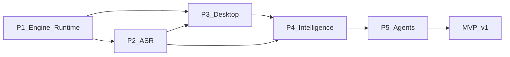
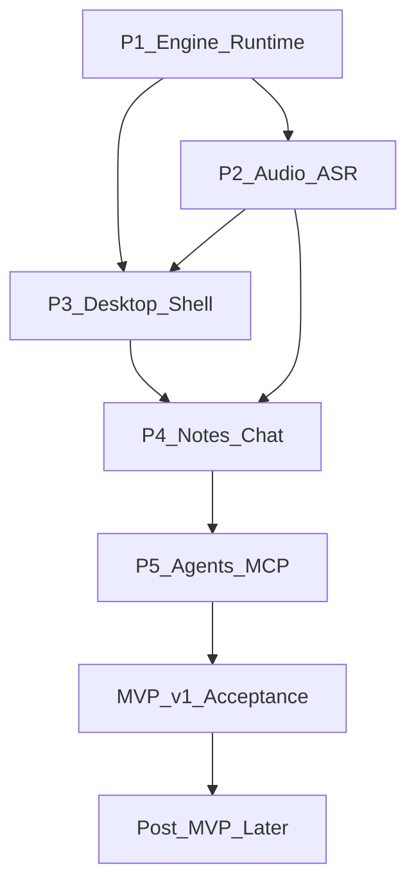

# Pitaya Roadmap

| Field | Value |
|-------|-------|
| **Version** | 0.5 |
| **Status** | Living (pre-implementation) |
| **Companion doc** | [ARCHITECTURE.md](ARCHITECTURE.md) v0.6 — normative technical design |
| **Last synced with Granola docs** | 2026-05-22 ([docs.granola.ai/llms.txt](https://docs.granola.ai/llms.txt)) |

Pitaya is a Linux-first, open-source meeting assistant modeled on [Granola](https://granola.ai)'s documented product behavior. This roadmap scopes **what** we build and **in what phase**; [ARCHITECTURE.md](ARCHITECTURE.md) defines **how** (crates, IPC, data model, SLOs).

---

## 1. How to read this roadmap

**Phases are context boundaries**, not a calendar. P1 through P5 express dependency order and increasing certainty about the product—nothing here is a deadline, quarter, or sprint commitment.

Each phase follows the same shape:

1. **Outcome** — the user or product result we want (goal first).
2. **Capabilities** — coarse, user-visible abilities that support the outcome.
3. **Success criteria** — observable exit checks (“User can…”), not implementation tasks.
4. **Dependencies** — prior phases and technical gates (with pointers into ARCHITECTURE).
5. **Explicitly not in this phase** — deferrals to prevent scope creep.

**Mental map to Now–Next–Later:** the active phase is *Now*; the next phase is *Next*; everything after MVP is *Later*. We use P1–P5 as the primary taxonomy because it matches engineering dependencies and ARCHITECTURE §10.

**Where detail lives:**

| Topic | Document |
|-------|----------|
| Product phasing, MVP scope, outcomes | This file |
| Crates, IPC, FSM, contracts, SLOs | [ARCHITECTURE.md](ARCHITECTURE.md) |
| Decision records | `docs/adr/` (when scaffold exists) |

**Anti-patterns for this doc:** Gantt dates, story-point promises, duplicating the ARCHITECTURE crate tree, PRO-tier gating language.

---

## 2. North star and MVP definition

### North star outcome

A Linux user gets a **Granola-class meeting OS**: ambient tray control, a full meeting loop (capture → live transcript → raw notes → **in-meeting Q&A** → enhance → scoped intelligence), **local-first** inference with optional cloud BYOK, and **no paid gate** on core features—delivered as **one native app** with an in-process engine; optional **`pitaya-mcp`** for agents—not Docker or Python sidecars.

### MVP (v1) outcome statement

A Linux user can install one native app, run a **first meeting without any API key**, complete the full meeting cycle—including **live Q&A during the call**—and trust that transcripts and notes stay **local** under user-chosen retention, with enhanced notes, citations, templates, recipes, and MCP agents on the same contracts as the desktop UI.

**MVP = complete P1 through P5** and satisfy the checklist below. Post-MVP work does not block calling v1 done.

### MVP acceptance checklist

Derived from [ARCHITECTURE.md §10.3](ARCHITECTURE.md#103-v1-acceptance-criteria). All must pass before MVP is declared complete.

- [ ] Tray start/stop works with the main window closed
- [ ] Full meeting loop runs without Docker or Python
- [ ] Default ASR works offline; first meeting succeeds without an API key
- [ ] **In-meeting chat** answers from the live transcript after ≥30s of audio
- [ ] **Hybrid `@` context** works alongside implicit scope; coverage shows pinned and consulted sources
- [ ] Full transcript is **persisted by default**; retention is user-configurable (auto-deletion optional)
- [ ] Enhanced notes include per-bullet citations; Ollama path works without API keys
- [ ] `pitaya-mcp` uses the same contracts as desktop; `get_meeting_transcript` works when segments are retained
- [ ] Transcript auto-deletion degrades regenerate, chat, and MCP quote tools with visible warnings
- [ ] Coverage metadata and incomplete-answer disclosure prevent unsupported confident answers
- [ ] Adaptive theme is coherent: light default plus [DESIGN.md](DESIGN.md)-backed dark theme
- [ ] App/engine cooperative shutdown drains committed transcript writes and exits cleanly
- [ ] No hidden cloud calls; active ASR/LLM adapters are visible before provider use
- [ ] No PRO gating; single process; no whisper HTTP sidecar process
- [ ] MCP config copyable from Settings; MCP works when app is running

---

## 3. Planning principles

These guide how we maintain this roadmap (aligned with outcome-based and date-free product practice in 2026):

1. **Goals before features** — each phase opens with an outcome; capabilities support it, not the reverse ([outcome-based roadmaps](https://www.romanpichler.com/blog/get-the-outcomes-on-your-product-roadmap-right/)).
2. **No date commitments** — phases replace quarters; progress is status-only ([Now–Next–Later](https://www.prodpad.com/blog/invented-now-next-later-roadmap/)).
3. **Observable exit criteria** — 2–5 user-visible checks per phase; technical gates appear only as dependencies with ARCHITECTURE § refs.
4. **Traceability** — every v1 surface in [ARCHITECTURE §1.1](ARCHITECTURE.md#11-north-star) maps to exactly one MVP phase (see [§7 v1 scope matrix](#7-v1-scope-matrix)).
5. **Hypotheses for distant work** — Post-MVP items state problems to solve, not fixed specs.
6. **Progress without timelines** — tracker uses `Not started` | `In progress` | `Done` only.

---

## 4. Phase map

| Phase | Outcome (goal) | User-visible win | Depends on |
|-------|----------------|------------------|------------|
| **P1** | Engine + local persistence + MCP-ready socket | Integration tests prove runtime | — |
| **P2** | Speech becomes text on-device | Offline transcription | P1 |
| **P3** | The app is a daily driver | Tauri daily driver (one install) | P1 (contract freeze) |
| **P4** | Meetings become intelligible during and after | Enhance + **in-meeting chat** | P2, P3 |
| **P5** | Power users and agents extend the system | Scoped chat, templates, recipes, MCP | P4 |

---

## 5. Phase detail

### P1: Engine and local protocol

#### Outcome

Developers can rely on a single in-process source of truth: `pitaya-engine` accepts commands, persists meeting state, exposes an MCP socket, and streams events over a frozen contract—without full UI or inference vendors in the loop.

#### Capabilities (coarse)

- Versioned command/query/event contracts shared by all clients (**chat DTOs**: `ChatSend`, `ContextRef`, `CoverageMeta`)
- `pitaya-core` as the only shared client/MCP crate: DTOs, IDs, schema export, error envelopes, no async/runtime dependencies
- `pitaya-meetings` for pure meeting lifecycle semantics and FSM transition rules
- Local SQLite persistence with migrations, repositories, WAL writer actor, and FTS foundation
- `pitaya-engine` library: meeting supervisor, in-process `EngineHandle`, MCP Unix socket listener
- Event stream to Tauri bridge (later) and MCP subscribers
- Integration test or dev harness drives `StartMeeting`/`StopMeeting` via `EngineHandle` or socket

**Pitaya delta:** No cloud account; all state local from day one.

#### Success criteria (exit)

- [ ] Integration test or dev harness drives `StartMeeting`/`StopMeeting` via `EngineHandle` or socket and receives `GetStatus` reflecting FSM state
- [ ] `StartMeeting` / `StopMeeting` transition the FSM and persist a `Meeting` row
- [ ] Events (`MeetingStarted`, `MeetingEnded`, `ErrorRaised`) reach a connected client
- [ ] Socket path and permissions match ARCHITECTURE (`$XDG_RUNTIME_DIR/pitaya/pitaya.sock`, mode `0600`)
- [ ] `pitaya-core` schemas are versioned and exportable to TypeScript
- [ ] Storage writer drains queued writes on cooperative shutdown
- [ ] Trace IDs connect command handling, FSM state changes, and persistence writes

#### Dependencies

- None (first phase)

**Technical gate (ARCHITECTURE):** `pitaya-core`, `pitaya-meetings`, `pitaya-storage`, and `pitaya-engine` boundaries are stable before contract freeze.

#### Explicitly not in this phase

- PipeWire capture or live transcription
- Desktop tray or React UI
- LLM enhancement, chat, or MCP tools
- Cloud ASR/LLM adapters

#### Architecture references

- [ARCHITECTURE §4](ARCHITECTURE.md#4-runtime-architecture) — runtime and FSM
- [ARCHITECTURE §5.2](ARCHITECTURE.md#52-dual-transport-v1-locked) — dual transport v1
- [ARCHITECTURE §10.1](ARCHITECTURE.md#101-build-sequence) items 1–2, 5

---

### P2: Hear → text locally

#### Outcome

A user can capture microphone and system audio on Linux and see accurate live transcription **offline**, with segments persisted locally—without Docker, Python, or a separate whisper HTTP process.

#### Capabilities (coarse)

- Dual-track capture (`mic` + `system`) via PipeWire (pulse compat where needed)
- `pitaya-audio` isolates PipeWire loop-thread capture and mock backend
- `pitaya-transcription` isolates VAD, local ASR adapters, model catalog, and ASR fallback policy
- Local ASR from a Handy-style model catalog (download/cache under XDG data dir)
- Live partial and final transcript segments appended to SQLite
- Stop/resume without ending the meeting session
- Optional cloud ASR via BYOK (feature-gated), never mandatory
- First-run step: recommend local model download (no API key required)

**Pitaya delta:** Local-first ASR default; Granola uses bundled cloud ASR. Audio files optional and off by default; transcript text persisted locally.

#### Success criteria (exit)

- [ ] User can record a Quick Note and see live partials for both mic and system channels
- [ ] Transcript segments persist after stop; search/FTS can find meeting text
- [ ] Default path transcribes without network or API keys after model download
- [ ] No separate whisper HTTP **process**; transcription stays in-process via router
- [ ] PipeWire callback path does only minimal handoff work and uses bounded channels
- [ ] Mock audio backend supports CI without PipeWire hardware access
- [ ] Offline ASR has a measured p95 partial latency baseline

#### Dependencies

- **P1** complete (engine FSM, storage, MCP socket)

#### Explicitly not in this phase

- Desktop tray UI (CLI or minimal harness is enough)
- Enhanced notes, citations, or in-meeting LLM chat
- Ollama/BYOK completion (beyond stubs if needed for plumbing tests)
- Call-detection auto-start, diarization, floating overlay

#### Architecture references

- [ARCHITECTURE §6.1–6.3](ARCHITECTURE.md#61-speech-and-language-adapters) — audio, ASR, LLM, and transcription
- [ARCHITECTURE §2.2–2.3](ARCHITECTURE.md#22-meeting-modes-and-startstop) — start/stop and onboarding step 1
- [ARCHITECTURE §3.3](ARCHITECTURE.md#33-linux-desktop-constraints) — Linux audio constraints

---

### P3: Daily driver shell

#### Outcome

A Linux user can live in Pitaya day to day: tray-first control, home for notes and manual upcoming, and a meeting note view with a virtualized live transcript—**one install, one process**, no manual engine setup.

#### Capabilities (coarse)

- Native install (AppImage/deb/Tauri bundle)—**single process**, engine starts in `tauri::setup`
- System tray: start/stop, status, notifications, open app—works with main window closed
- Home: today, manual upcoming list, recent notes, search, basic folders
- Meeting note: raw markdown editor, live transcript panel (mic vs system), stop/pause
- **Chat bar shell**: input, scope label, thread panel layout; send disabled or gated until P4 LLM setup
- First-run onboarding: local ASR → Ollama/BYOK/skip → guided Quick Note tour
- Settings shell: models, retention, BYOK entry, MCP path, language/jargon (wiring as needed)
- **Settings schema version** with forward migration on startup (`$XDG_CONFIG_HOME/pitaya/settings.toml`)
- **Setup doctor:** extend `pitaya-desktop --check-deps` with config schema, DB migration version, and adapter health for onboarding diagnostics
- Design system: adaptive warm glass, light theme default, first-class dark theme from [DESIGN.md](DESIGN.md), calm home (no dashboard charts). Stitch prompt docs are planned with the design scaffold.

**Pitaya delta:** No Google/Microsoft SSO; manual upcoming instead of calendar OAuth. Quit from tray exits app; engine shuts down cooperatively (v1 policy).

#### Success criteria (exit)

- [ ] User installs one bundle; one process—no manual engine setup
- [ ] Tray start/stop recording works with main window closed
- [ ] Home lists recent notes and supports basic search/folders
- [ ] Live transcript panel updates via **Tauri events** with distinguishable mic/system tracks
- [ ] Transcript UI p95 latency measured after coalescing (target: panel paint < 100ms from engine event)
- [ ] Chat bar renders with scope label and thread panel layout (intelligence deferred to P4)
- [ ] First-run onboarding completes in ≤3 steps to first Quick Note without any API key
- [ ] Setup diagnostics make missing PipeWire/libsecret/Ollama states visible
- [ ] **Settings survive app upgrade** without manual TOML edits (schema version + startup migration)
- [ ] [DESIGN.md](DESIGN.md) tokens on home, meeting note, and tray menu before P4 AI polish

#### Dependencies

- **P1** complete, including **IPC contract freeze** (commands/queries/events versioned and mirrored to TypeScript before desktop ships)
- **P2** complete (live ASR path end-to-end)

**Technical gate:** ARCHITECTURE §5.2 dual transport contract freeze before P3 desktop.

#### Explicitly not in this phase

- AI-enhanced notes and per-bullet citations
- In-meeting or post-meeting LLM chat (chat bar is **chrome only**)
- `@` autocomplete picker, pinned context chips (P4 partial / P5 full)
- Templates, recipes, multi-meeting scoped chat
- MCP server
- Rewrite-on-section, dictation on chat bar, floating live chip

#### Architecture references

- [ARCHITECTURE §1.4](ARCHITECTURE.md#14-chat-as-core-pillar) — chat as core pillar
- [ARCHITECTURE §2.4](ARCHITECTURE.md#24-ux-surfaces-pitaya-desktop) — UX surfaces
- [ARCHITECTURE §2.7](ARCHITECTURE.md#27-chat-ux-surfaces) — chat UX surfaces
- [ARCHITECTURE §3.1](ARCHITECTURE.md#31-end-user-path) — distribution and single-process install
- [ARCHITECTURE §3.2](ARCHITECTURE.md#32-paths-and-layout) — paths and settings layout
- [ARCHITECTURE §6.7](ARCHITECTURE.md#67-frontend-pitaya-desktop) — frontend stack
- [ARCHITECTURE §6.13](ARCHITECTURE.md#613-agent-harness-and-prompt-layers-hermes-informed) — local update hygiene (settings migration)

---

### P4: Meeting intelligence

#### Outcome

During and after a meeting, the product delivers Granola-class intelligence: raw notes guide enhancement, citations prove claims, **in-meeting Q&A** uses live context, and post-stop chat/rewrite work on enhanced material—without sending provider traffic through the webview.

#### Capabilities (coarse)

- Post-stop **enhance** pipeline: raw notes + transcript + metadata → enhanced revision with citation graph
- `pitaya-markdown`: CommonMark subset + `[[citation:uuid]]` citation AST shared by UI, exports, and MCP quote paths
- `pitaya-notes`: template application, prompt registry, enhanced revisions, and citation synthesis
- `pitaya-llm`: Ollama/BYOK completion adapters and model-class routing
- `pitaya-context`: active/single-meeting scope resolution, context budgets, retrieval trace, coverage semantics
- `pitaya-chat`: in-meeting Q&A, single-meeting post chat, rewrite rules, streaming turn state
- **In-meeting chat** (“Ask anything”) over live transcript + raw notes while `Recording` or `Paused`
- Post-stop scoped chat on single meeting (full transcript + enhanced + raw)
- Optional `@note` / `@transcript` attachments on active/single meeting (hybrid context, §2.6)
- Coverage metadata: pinned attachments + consulted sources (single-meeting scope)
- Completion via Ollama (local) and BYOK; user sees active adapter, no silent switches
- Templates shape enhanced structure; regenerate with template
- Transcript retention: full segments by default; user-configurable auto-deletion (notes kept)
- Post-stop section rewrite (not during-meeting rewrite)
- **Frozen prompt assembly** per `ChatSend`: system policy + scope frozen at turn start; `prompt_version_id` + content hash on persisted `ChatMessage`
- **Iteration budget:** capped retrieval passes and LLM rounds per turn; `CoverageMeta.incomplete` when budget exhausted (§6.13)

**Pitaya delta:** Typed chat input v1 (dictation on chat bar later). During-meeting = Q&A only, not rewrite. Chat threads local/private. `@` attachments limited to active meeting note/transcript in P4.

#### Success criteria (exit)

- [ ] User stops a meeting and receives enhanced notes with per-bullet citations linked to transcript/raw spans
- [ ] **During recording**, chat answers grounded in live transcript after ≥30s of audio (MVP bar)
- [ ] Coverage panel shows consulted sources for single-meeting chat; optional `@note`/`@transcript` pins work
- [ ] Enhanced note regeneration respects template choice
- [ ] Transcript segments remain queryable after meeting unless user enables auto-deletion
- [ ] Provider HTTP never originates from the webview; chat streams via **Tauri events** (`ChatDelta`); tray/settings show active adapter
- [ ] Golden fixtures cover in-meeting Q&A, post-meeting Q&A, rewrite, and enhancement
- [ ] Prompt snapshots (`insta`) keyed by **`prompt_version_id`**; mid-turn system policy does not mutate
- [ ] Groundedness checks catch unsupported claims against cited spans
- [ ] Iteration budget triggers incomplete-answer disclosure when retrieval cap hit before adequate coverage
- [ ] Transcript auto-deletion shows degraded regenerate/chat behavior instead of silently failing

#### Dependencies

- **P2** (transcription + persistence)
- **P3** (meeting note UI, chat bar shell, settings for models)
- Soft parallel: notes/prompt work may start late P3 only where UI contracts exist; **in-meeting chat ships in P4**, not Post-MVP

#### Explicitly not in this phase

- Home/folder/multi-meeting scoped chat (P5)
- Full `@` autocomplete picker (P5)
- Recipes and `/` recipe picker in chat bar (P5)
- MCP tools
- Multi-meeting retrieval / fastembed vectors (P5)
- Chat file upload, dictation on chat bar

#### Architecture references

- [ARCHITECTURE §1.4](ARCHITECTURE.md#14-chat-as-core-pillar) — chat pillar
- [ARCHITECTURE §2.5–2.6](ARCHITECTURE.md#25-in-meeting-chat-v1--granola-parity) — in-meeting chat + hybrid context
- [ARCHITECTURE §6.4–6.9](ARCHITECTURE.md#64-note-generation) — notes, chat, renderer, retention
- [ARCHITECTURE §6.13](ARCHITECTURE.md#613-agent-harness-and-prompt-layers-hermes-informed) — prompt assembly and iteration budget
- [ARCHITECTURE §7.1–7.2](ARCHITECTURE.md#7-agentic-intelligence-and-retrieval) — principles (single-meeting fidelity)

---

### P5: Power users and agents

#### Outcome

Users can organize knowledge across meetings, run templates and recipes repeatedly, and connect external agents via local MCP—with read-first safety, audited mutators, and the same IPC contracts as the desktop—without paying for transcript access.

#### Capabilities (coarse)

- Scoped chat from home, folder, and multi-meeting selection with retrieval loop (FTS5; optional vectors)
- **Full `@` picker**: autocomplete via `ListContextCandidates`; pinned chips on chat bar
- Coverage metadata for multi-meeting answers (pinned vs consulted chip groups)
- Recipes: static prompts, `/` in chat bar, `RunRecipe` through engine
- **Bundled recipes/templates sync** with origin-hash `.bundled_manifest`; user edits preserved on app upgrade; Settings reset-to-bundled
- **Optional dev trajectory export:** JSONL of chat turns with `RetrievalTrace` + `prompt_version_id` (opt-in, default off; §6.13)
- Templates management in settings; enhanced note regenerate
- `pitaya-mcp` stdio server → app socket; **same release** as desktop; Settings **Copy MCP config**
- MCP read tools: `query_meetings`, `list_meetings`, `get_meeting`, `get_meeting_transcript`, folders, profile
- MCP mutating tools with audit log and rate limits; host confirmation policy for mutations
- Cloud ASR/LLM adapters feature-gated (BYOK); completion/transcription routers fully wired
- Export markdown/HTML from UI

**Pitaya delta:** MCP is local stdio, not Granola remote OAuth HTTP. `get_meeting_transcript` included free (subject to retention), not plan-gated.

#### Success criteria (exit)

- [ ] User chats from home across multiple meetings with visible coverage of which notes/meetings were used
- [ ] User pins context with `@` (meetings, folders, `@today`) and sees pinned vs consulted coverage chips
- [ ] User runs a recipe from the chat bar and receives a streamed result persisted locally
- [ ] External MCP client lists meetings and fetches transcript consistent with retention policy
- [ ] Mutating MCP calls appear in audit log; policy blocks silent destructive actions
- [ ] Multi-meeting retrieval passes quality and latency gates before optional vector search is enabled
- [ ] `pitaya-mcp` reaches data only through app socket IPC and shared `pitaya-core` contracts
- [ ] Pinned context and consulted context stay distinct in UI and MCP answers
- [ ] **Shipped recipe/template update does not overwrite** user-modified copies (bundled manifest)
- [ ] MCP `query_meetings` and desktop chat share the same retrieval path through `pitaya-context`
- [ ] MVP acceptance checklist (§2) fully satisfied

#### Dependencies

- **P4** complete (enhance, citations, renderer, in-meeting + single-meeting chat, Ollama path)

#### Explicitly not in this phase

- Calendar OAuth, SSO, team workspaces
- REST API, Slack/Notion integrations
- Remote OAuth MCP, macOS port
- Call-detect overlay, diarization as product feature
- Pre-meeting briefs (v2)

#### Architecture references

- [ARCHITECTURE §6.5–6.6](ARCHITECTURE.md#65-chat-and-recipes) — chat scopes and recipes
- [ARCHITECTURE §6.11](ARCHITECTURE.md#611-integrations--mcp-v1) — MCP v1
- [ARCHITECTURE §6.13](ARCHITECTURE.md#613-agent-harness-and-prompt-layers-hermes-informed) — bundled manifest and dev export
- [ARCHITECTURE §7.2](ARCHITECTURE.md#72-pitaya-retrieval-local) — multi-meeting retrieval

---

## 6. Quality gates

These gates protect the Granola-class v1 ambition from becoming vague scope. They do not add dates; they define evidence needed before a phase is considered complete.

| Gate | Applies by | Evidence |
|------|------------|----------|
| Contract stability | P1/P3 | `pitaya-core` command/query/event schemas versioned and mirrored to TypeScript before desktop ships |
| Engine/runtime foundation | P1/P2 | bounded channels on hot paths; storage writer drains on cooperative shutdown; trace IDs connect commands → FSM → storage |
| Linux capture | P2/P3 | PipeWire loop-thread harness, mock backend in CI, setup diagnostics for permissions and missing monitor source |
| Local-first trust | P2/P4/P5 | first meeting without API key; no provider HTTP in webview; active ASR/LLM adapter visible before cloud use |
| AI groundedness | P4/P5 | golden fixtures, prompt snapshots, cited-span checks, coverage metadata, incomplete-answer behavior |
| Retrieval quality | P5 | FTS5/BM25 baseline before vectors; optional vector/RRF gate only if it improves quality without breaking latency |
| Security and agents | P5 | MCP audit log, mutator confirmation policy, transcript retention degradation, no direct MCP storage access |
| UI latency | P3 | transcript panel p95 < 100ms from engine event to paint (after coalescing) |
| Product feel / taste | P3/P4 | [DESIGN.md](DESIGN.md) on home, meeting note, tray before P4 AI; light default + dark theme coherent |
| Local update hygiene | P3/P5 | settings schema migrate on startup; SQLite migrations on upgrade; bundled recipes/templates manifest; cooperative engine restart after config change |

---

## 7. v1 scope matrix

Maps [ARCHITECTURE §1.1](ARCHITECTURE.md#11-north-star) surfaces and Appendix A parity rows to MVP phases.

| Surface / feature | In MVP? | Phase | Notes |
|-------------------|---------|-------|-------|
| System tray | Yes | P3 | Primary ambient control |
| Home (today, manual upcoming, recent, search, folders) | Yes | P3 | Calendar OAuth is v2 |
| Meeting note (raw + live transcript + in-meeting chat + stop) | Yes | P3–P4 | Chat intelligence in P4 |
| Post-meeting enhance + citations + template regenerate | Yes | P4 | |
| Scoped chat + recipes (hybrid implicit + `@` context) | Yes | P4–P5 | Single meeting P4; multi + full `@` P5 |
| **@ context tagging (Cursor-like)** | Yes | P4–P5 | P4: `@note`/`@transcript`; P5: full picker |
| Settings (models, retention, BYOK, MCP, jargon) | Yes | P3–P5 | Full wiring through P5 |
| Local MCP agents | Yes | P5 | Read-first; audited mutators |
| Trust (chosen providers, no silent switch) | Yes | P4–P5 | |
| Mic + system dual-track | Yes | P2–P3 | PipeWire |
| Full transcript retention + auto-deletion | Yes | P2–P4 | Default persist |
| Local-first ASR + BYOK cloud | Yes | P2, P5 | Cloud adapters gated |
| Ollama + BYOK LLM | Yes | P4–P5 | |
| No cloud account / no PRO gating | Yes | All | |
| Demo onboarding (Quick Note tour) | Yes | P3 | No SSO demo |
| OSS markdown renderer + citations | Yes | P4 | |
| Agentic retrieval + coverage metadata | Yes | P4–P5 | |
| Prompt versioning (`prompt_version_id` + snapshots) | Yes | P4–P5 | Frozen assembly §6.13 |
| Settings schema migration on upgrade | Yes | P3 | `$XDG_CONFIG_HOME/pitaya/` |
| Bundled recipe/template sync (origin-hash manifest) | Yes | P5 | User edits preserved |
| Local stdio MCP (not remote OAuth) | Yes | P5 | |
| Free `get_meeting_transcript` MCP tool | Yes | P5 | Retention applies |
| Native AppImage/deb; single process; no Docker required | Yes | P3 | One install, engine in-process |

---

## 8. Post-MVP / Later

Work after MVP is grouped by intent. Items are **problems to explore**, not committed specs.

### Tier A — Polish (post-P5, still Linux v1 quality)

Optional stretch after MVP; does not block v1 declaration.

| Problem | Direction | Depends on |
|---------|-----------|------------|
| User misses when a call starts | Assistive call-detect (PipeWire app hints + VAD); never silent auto-start | MVP tray + P2 audio |
| Hard to see “still recording” without opening app | Floating live indicator chip | P3 shell |
| Hard to attribute quotes on single mixed track | Speaker diarization library (`pitaya-diarization`) | P2 dual-track baseline |
| IPC overhead at scale | MessagePack framing (optional) | P1 contract freeze |
| Weak GPU / CPU tradeoffs | GPU whisper feature tiers; tuning per ARCHITECTURE §8 | P2 transcription |

### Tier B — v2 product expansion

| Problem | Direction | Depends on |
|---------|-----------|------------|
| Manual upcoming is tedious | Google/Outlook calendar OAuth + sync | MVP home |
| No context before join | Pre-meeting briefs from local notes + calendar ([Granola briefs](https://docs.granola.ai/help-center/taking-notes/pre-meeting-briefs.md)) | Calendar + P4 notes |
| Relationship context is hidden | People/Companies views from calendar attendees and local notes; chat scoped to a person/company | Calendar + P5 retrieval |
| Cannot share with team | Team workspaces, sharing; chat stays author-private | Local workspace v1 |
| Linux-only limits audience | macOS desktop port | MVP architecture |
| Agents need HTTP integrations | REST API (Granola API shape as reference); Slack/Notion | MCP v1 |
| Enterprise MCP expectations | Evaluate remote MCP/OAuth vs local stdio default | ADR-004 follow-on |
| Third-party extensions need safety | Manifest-defined subprocess plugins with permissions, audit logs, and engine restart isolation | MVP contracts |
| Chat input friction | Dictation on chat bar (question only, not transcription) | P4+ chat |
| Richer chat context | File upload in chat (beyond `@` attachments) | P5 chat |
| Migration from Granola cloud | Optional [`granz`](https://github.com/dmwyatt/granz)-style import | MVP storage |
| Headless / CI deployments | Extract headless binary from `pitaya-engine` | MVP engine |

### Tier C — Explicit non-goals (unchanged)

See [ARCHITECTURE §1.3](ARCHITECTURE.md#13-explicit-non-goals-v1). These remain out of scope until deliberately promoted with a new ADR and roadmap tier:

- Docker/compose as required desktop install
- Python FastAPI, whisper HTTP sidecar, pyannote sidecar
- Mandatory cloud-only ASR
- Team workspaces, calendar OAuth, REST API **in v1**
- WYSIWYG editor
- Diarization as MVP ship blocker
- Flatpak-first distribution

---

## 9. Risks and open decisions

No dates—only “decide before” phase hints where useful.

| Topic | Risk / question | Decide before |
|-------|-----------------|---------------|
| Linux audio permissions | Portal/PipeWire consent UX may block first capture | P2 |
| Model download size | Large ASR models affect first-run success on slow networks | P2 onboarding |
| Ollama detection | False negatives push users to BYOK prematurely | P3 onboarding |
| Adaptive design system | Light default and `DESIGN.md` dark tokens may drift | P3 |
| Semantic crate boundaries | Feature logic could leak into Tauri commands instead of `pitaya-engine` | P1/P4 |
| Tauri command surface creep | Keep commands thin; business logic stays in `pitaya-engine` | P3 |
| MCP requires running app | Settings must document app-must-be-running clearly | P5 |
| MCP mutator policy | How host confirms `meeting_start` / `note_append` mutations | P5 |
| Calendar provider (v2) | Google vs Outlook vs both for OAuth | Tier B planning |
| Retention + MCP quotes | Auto-deletion must degrade tools gracefully (notes-only fallback) | P4 settings |
| `@` vs implicit scope conflicts | Attachment outside base scope UX (`ChatContextWarning`) | P5 |
| `@` picker performance | FTS autocomplete latency on large meeting libraries | P5 |
| Hybrid retrieval | Optional vector search must beat FTS5 baseline before shipping | P5 |
| Bundled manifest reset UX | How Settings exposes reset-to-bundled without surprising data loss | P5 |
| Settings rollback after downgrade | Older binary may not understand newer config keys | P3/P5 |
| Dev trajectory export privacy | JSONL export opt-in default off; what fields are included | P5 |
| Extension model | Post-v1 plugins should be process-isolated, permissioned, and auditable | Tier B planning |

---

## 10. Progress tracker

Status only—no dates or ETAs.

| Phase | Status | MVP criterion group |
|-------|--------|---------------------|
| P1 — Engine and local protocol | Not started | Engine/runtime foundation |
| P2 — Hear → text locally | Not started | Offline ASR + persistence |
| P3 — Daily driver shell | Not started | Tray, home, live transcript |
| P4 — Meeting intelligence | Not started | Enhance, citations, **in-meeting chat** |
| P5 — Power users and agents | Not started | Multi-scope chat, recipes, MCP |
| **MVP (v1) acceptance** | Not started | §2 checklist complete |

---

## 11. References

- [ARCHITECTURE.md](ARCHITECTURE.md) — normative technical design (v0.6)
- [Granola docs index](https://docs.granola.ai/llms.txt)
- [Granola 101](https://docs.granola.ai/help-center/getting-started/granola-101.md)
- [How Granola designs agents](https://www.granola.ai/blog/how-granola-thinks-about-designing-agents)
- [Hermes Agent architecture](https://hermes-agent.nousresearch.com/docs/developer-guide/architecture) — harness and local update patterns (ARCHITECTURE §6.13)
- [ADR index](ARCHITECTURE.md#appendix-b--adr-index-initial) — full prose in `docs/adr/` when scaffold exists
- Outcome-based roadmaps: [Roman Pichler (2026)](https://www.romanpichler.com/blog/get-the-outcomes-on-your-product-roadmap-right/)
- Date-free horizons: [Now–Next–Later (ProdPad)](https://www.prodpad.com/blog/invented-now-next-later-roadmap/)
